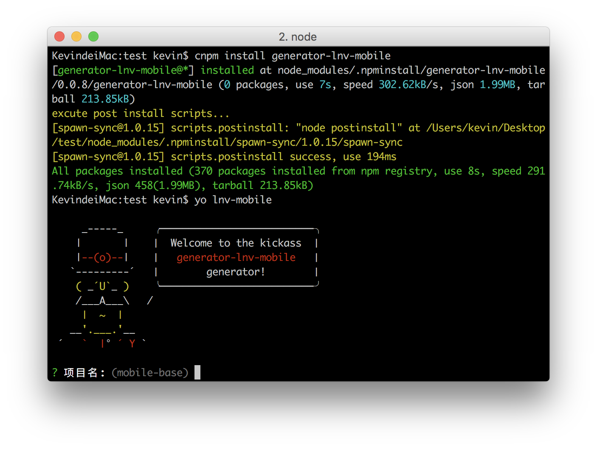

## 针对移动端的前端工作流(1)—基础库概览

在移动端项目的开发中，我们会遇到诸如移动端技术选型、移动端适配、预处理器语言的使用规范和编译、各种繁琐的工作（压缩、合并、内联、雪碧图、CSS前缀……）等问题，在一遍又一遍的重复劳动中，我们需要一个能够结合最佳实践的项目初始文件，本套工作流就是以这个目的进行构建，旨在提高移动端项目开发效率。

这套工作流与其叫工作流这么高大上的名字，我更愿意叫它基础库。如它的名字一样，它就是用来作为项目的基础，在良好的基础上开发的项目，才像是站在巨人的肩膀上，才能保证项目的质量与效率。

此外因为是针对移动端（尤其是活动类项目）开发的基础库，技术选型还算简单，尤其适合初入移动端以及刚做移动端不久的前端人，即使做了一段时间的移动端，了解这套基础库的架构和功能实现，或许也有增益。

接下来让我们来了解这个基础库的各个方面。

### 基础库技术选型

在正式去了解这套基础库前，首先介绍它的技术选型，让你有个大概的了解。

* zepto.js + deferred.js + callbacks.js + touch.js（库）
* flexible.js（移动端rem适配方案）
* handlebars（模板引擎）
* gulp（自动化构建工具）
* sass（预处理器语言）

### 基础库实现的功能

看完技术选型后，看看它能实现哪些功能，是否满足你的需求。

1. Sass编译
2. Css Js 图片压缩
3. Css Js 合并
4. Css Js 内联
5. Html的include功能
6. Autoprefixer
7. 自动刷新
8. 去缓存
9. 提供Handlebars模板文件的预编译
10. 提供常用功能函数
11. 雪碧图
12. ESLint
13. rem移动端适配方案
14. 内置样式与WeUI样式相同的loading、dialog组件

### 基础库的环境安装

OK, 如果你决定尝试下这套基础库，首先要确保你有相应的环境，下面这些是步骤：

1.下载[nodejs](https://nodejs.org/en/)，安装

2.安装[cnpm](http://npm.taobao.org/)，实际上你只用在终端执行下面这句命令就可以了。

```bash

	npm install -g cnpm --registry=https://registry.npm.taobao.org

```

3.安装[gulp](http://www.gulpjs.com.cn/docs/getting-started/)，同样你需要执行下面这句命令。

```bash

	cnpm install --global gulp

```

### 基础库代码获取

安装完环境，我们需要获取代码，获取代码有两种方式：

1.[github](https://github.com/mqyqingfeng/lnv-mobile-base)

```bash

	git clone git@github.com:mqyqingfeng/lnv-mobile-base.git

```

2.[yeoman](https://github.com/mqyqingfeng/generator-lnv-mobile)

```bash

	cnpm install -g yo

	cnpm install -g generator-lnv-mobile

	yo lnv-mobile

```

效果如图：



输入项目名称，会以输入的项目名称建立文件夹，基础库的代码会自动创建。

### 基础库运行

获取文件后，进入文件根目录，请记住，在全部的使用中，就俩命令：

1.开发时使用：

```bash

	gulp

```

当你开启`gulp`命令后，不要关闭终端，gulp会监控`src`目录下的变化，根据文件的不同进行对应的操作。

2.最终构建：

```bash

	gulp build

```

当你执行`gulp build`命令后，会自动压缩、合并、内联、去缓存，这是最终的上线版本。

### 基础库目录结构

在介绍基础库的各个功能之前，首先了解一下目录结构。

`src`下:

```

├── src/                        # 源文件
    └── font          	    	# 字体文件
    └── img           		    # 图片
    └── include           	 	# include文件
    └── js           		 	# js
    └── scss           	 		# scss
    └── static           		# 静态资源
    └── tpl           		 	# handlebars模板
    └── widget           		# 组件
    └── index.html        	 	# index.html

```

执行`gulp`命令后， 会生成`dev`目录

```

├── dev/                        # dev目录
    └── font           	    	# 字体文件目录
    └── img           		    # 图片目录
    └── js           		 	# js
    └── css           	 		# css目录
    └── static           		# 静态资源目录
    └── tpl           		 	# handlebars模板目录
    └── widget           		# 组件目录
    └── index.html        	 	# index.html

```

执行`gulp build`命令后, 会生成`build`目录

```

├── build/                      # 构建目录
    └── combined           	    # 合并后的文件目录
    └── img           		    # 图片目录
    └── js           		 	# js
    └── css           	 		# css目录
    └── static           		# 静态资源目录
    └── widget           		# 组件目录
    └── index.html        	 	# index.html

```

注意`dev`目录是通过`src`目录生成的，任何时候都不要直接更改`dev`目录里的内容！！！

而`build`目录是最终构架出的目录，是最终要在线上使用的版本。

注意`node_modules`文件夹是不提交的！！！