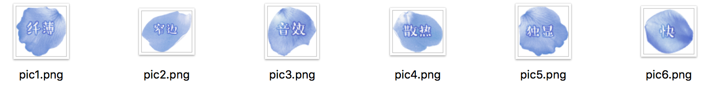
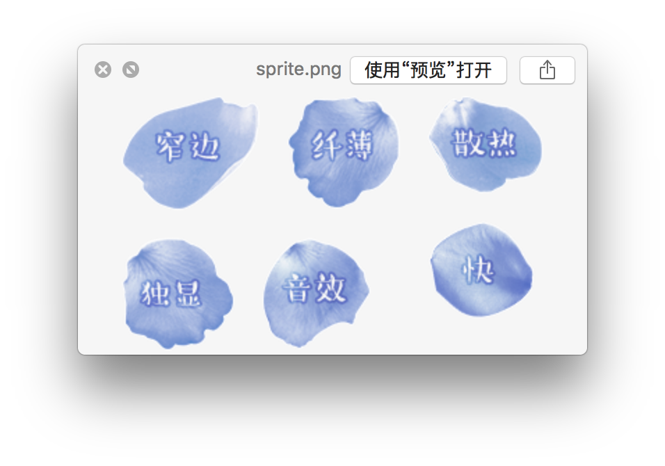
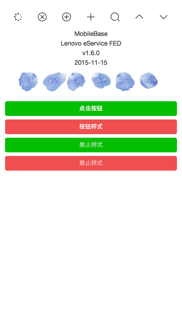

## 针对移动端的前端工作流(10)—雪碧图

### 有这个需求

雪碧图是为了减少请求数，嗯，就这样。

### 雪碧图的实现

在`src/img`目录下有一个文件夹是sprite，放在这里的图片会生成一张雪碧图

开启`gulp`命令后，会实时监控sprite文件夹的变化，如果有变化，就会生成

1. `sprite.png`，放在`src/img`目录下。

2. 对应的`sprite.scss`，放在`src/scss/sprite`/下。

那么该如何使用呢？

### 举个例子

现在在sprite目录下有六张图片， 嗯，就是这奇怪的六张图，知道它在描述什么吗？哦，不重要……



执行`gulp`的命令的时候，就会根据六张图片，生成一个`sprite.png`到`src/img`目录下



同时生成对应的`sprite.scss`，放在`src/scss/sprite`/下,这是`sprite.scss`

``` css

/*
SCSS variables are information about icon's compiled state, stored under its original file name

.icon-home {
  width: $icon-home-width;
}

The large array-like variables contain all information about a single icon
$icon-home: x y offset_x offset_y width height total_width total_height image_path;

At the bottom of this section, we provide information about the spritesheet itself
$spritesheet: width height image $spritesheet-sprites;
*/
@mixin sprite-pic1 {
    background-position: -119px 0px;
}

@mixin sprite-pic2 {
    background-position: 0px 0px;
}

@mixin sprite-pic3 {
    background-position: -101px -102px;
}

@mixin sprite-pic4 {
    background-position: -220px 0px;
}

@mixin sprite-pic5 {
    background-position: 0px -102px;
}

@mixin sprite-pic6 {
    background-position: -220px -90px;
}

.sprite {
    background-image: url('../img/sprite.png');
    background-repeat: no-repeat;
    background-size: 303px 183px;
}

```

如何使用`sprite.scss`呢？

html文件：

``` html

<ul class="sprite-list">
    <li class="sprite sprite-item1"></li>
    <li class="sprite sprite-item2"></li>
    <li class="sprite sprite-item3"></li>
    <li class="sprite sprite-item4"></li>
    <li class="sprite sprite-item5"></li>
    <li class="sprite sprite-item6"></li>
</ul>

```

在`index.scss`文件中引入`sprite.scss`

``` css

@import "sprite/_sprite";

.sprite {
  width: 100px;
  height: 80px;
  float: left;
  margin-top: 20px;
  margin-bottom: 20px;
}

.sprite-item1 {
  @include sprite-pic1;
}

.sprite-item2 {
  @include sprite-pic2;
}

.sprite-item3 {
  @include sprite-pic3;
}

.sprite-item4 {
  @include sprite-pic4;
}

.sprite-item5 {
  @include sprite-pic5;
}

.sprite-item6 {
  @include sprite-pic6;
}

```

OK，在页面你就可以看见预览效果了。



开启`gulp`命令后，命名窗口不需要关闭，gulp会实时监控sprite文件夹的变化，如果有变化，就会执行上述操作。