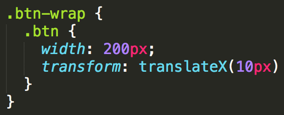
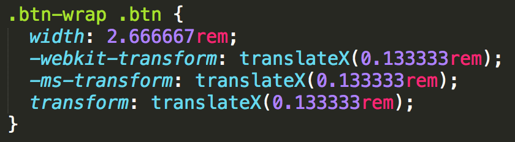

## 针对移动端的前端工作流(3)—Sass的使用姿势

### sass文件的编译与px to rem的转换

基础库使用的预处理器是sass，为什么会选择sass呢？这是因为当时在选择sass和less的时候，简单的了解了下它们：sass是功能强大但是入门门槛高，less是功能稍微薄弱，但是入门简单，而我认为功能强大是工具的事情，但是入门门槛高则是个人的问题，不能以个人的问题来决定使用何种工具，所以最终选择了sass，（现在想想，当时还是很天真啦，其实两者的区别并不是像我想象的如此肤浅），于是便一直使用sass。

sass文件的编译用的是gulp的`gulp-sass`，当执行`gulp`后，会监控`src/scss`下scss文件的变化(并不是`src/scss`所有的文件，只有在`src/scss`一级目录下的scss文件)，如果发生变化，就会实时编译成css到`dev/css`目录下。

接着我们会用`gulp-autoprefixer`插件自动补全Css前缀。

最后我们会进行px to rem的转换，转换的规则就是所有的 `px值` 除以 `75` 计算出`rem`值。

通过下面这个示例代码，一目了然。

处理前：



处理后：



至于为什么转化规则是除以 `75` 呢？

这是因为我们这里的移动端设计稿都是 750px 的，我们用PS测量一个按钮为150px的时候，我们就直接写这个按钮的width为150px，这感觉就像写固定布局一样！gulp会为我们自动处理px to rem。

但是如果你的设计稿是640px呢？这个该怎么处理？这时候就需要你修改下gulpfile.js中的配置文件：

``` js

gulp.task('dev_sass', function() {

    var processors = [px2rem({ remUnit: 75 })]; //根据你的设计稿宽度除以10修改这里的remUnit值

    return gulp.src(path.src.scss + "*.scss")
        .pipe(sass().on('error', sass.logError))
        .pipe(autoprefixer({
            browsers: ['last 5 versions'],
            cascade: false
        }))
        .pipe(postcss(processors))
        .pipe(gulp.dest(path.dev.css))
        .pipe(notify({
            message: 'scss文件编译成功'
        }))

});

```

对了，你还可能遇到一个坑，那就是如果你设置按钮的border为1px时

这是scss文件：

``` css

  .btn {
    border: 1px solid #ccc;
  }

```

这是处理后的css文件：

``` css

  .btn {
    border: 0.013333rem solid #ccc;
  }

```

在浏览器中预览时你会看见它的边框，但是当你到了手机上的时候，这条线是没有的！！！

想当初百思不得其解，突然灵光一现，发现了其中蹊跷，那就是手机中算 `0.013333rem`值的时候可能都算不到`1px`大小，所以直接就不显示了……

所以我们不想让gulp对border的1px进行处理的时候该怎么办呢？

这时候，我们就需要加上特殊的标示告诉gulp此处请不要转换，看下面的示例代码：

这是scss文件：

``` css

  .btn {
    border: 1px solid #ccc; /*no*/
  }

```

这是处理后的css文件：

``` css

  .btn {
    border: 1px solid #ccc;
  }

```

### scss目录结构

#### 目录结构

在`src/scss`目录下，包含了很多细分功能的scss文件。这是scss的目录结构

```

├── src/                        	# 源文件目录
    └── scss/           	 		# scss目录
    	└── helper/
    		└── _color.scss     	# 色板
    		└── _normalize.scss 	# 重置
    		└── _rules.scss     	# 规则
    		└── _util.scss      	# util
    	└── sprite/
    		└── _sprite.scss        # 根据雪碧图生成的scss文件
    	└── ui/
    		└── _animation.scss     # 动画
    		└── _button.scss        # 按钮组件
    		└── _global.scss        # 全局
    		└── _icon.scss         	# 字体图标
    		└── _loading.scss       # 页面加载loading样式
    	└── index.scss


```

#### helper

先介绍`helper`目录，这里包括了一些帮助项目开发的类

1._color.scss

这里存放着一些扁平的颜色变量，当你没有合适的颜色的时候，可以考虑选择尝试其中的颜色。[查看这些颜色](http://flatuicolors.com/)

2._normalize.scss

样式重置，基于normalize.css，在此基础上加了针对移动端的一些东西，其中要注意的是这样一句：

``` css

	* {
	    -webkit-box-sizing: border-box;
	    -moz-box-sizing: border-box;
	    box-sizing: border-box;
	}

```

这句话直接改变了所有元素的盒模型，当你设置一个元素为 `box-sizing: border-box;`时，此元素的内边距和边框不再会增加它的宽度，绝对是开发福利！

3._rules.scss

在这里设置常用的scss变量，占位符，mixin，请大家在项目开发中不断的完善！

4._util.scss

提供常用的工具类， 让我们在这里做个预览：

``` css

/**
 * 隐藏元素
 */

.hidden,
[hidden] {
    display: none !important;
}


/**
 * 弹性图片
 */

.lnv-img {
    max-width: 100%;
    height: auto;
    display: block;
}


/**
 * 清除浮动
 */

.clear {
    clear: both;
}


/**
 * 解決高度塌陷問題
 */

.clearfix:after {
    content: ' ';
    display: block;
    height: 0;
    clear: both;
    visibility: hidden;
}

.clearfix {
    zoom: 1;
}


/**
 * 单行文本超过宽度显示为三个点
 */

.dot {
    overflow: hidden;
    white-space: nowrap;
    text-overflow: ellipsis;
}


/**
 * 三角符号
 */

.lnv-triangle {
    display: inline-block;
    width: 0;
    height: 0;
    margin-left: 2px;
    vertical-align: middle;
    border-top: 4px dashed;
    border-top: 4px solid \9;
    border-right: 4px solid transparent;
    border-left: 4px solid transparent;
}

/**
 * 不被选中
 */
.noselect {
    -webkit-user-select: none;
    -moz-user-select: none;
    -ms-user-select: none;
    -o-user-select: none;
    user-select: none;
}

```

#### ui

`ui`文件夹下存放与ui相关的scss文件。

1. _animation.scss

这里存放着与动画有关的样式。

2. _button.scss

这里存放着组件类的样式,如按钮、表单、表格等，这里只写了button类，其他的需要大家在项目开发中完善。之所以设置组件类，是为了方便项目后期的迭代。

3. _global.scss

这里存放自定义的全局变量。

4. _icon.scss

这里存放着字体图标有关的样式。

5. _loading.scss

这里存放着页面加载loading的样式

#### sprite

sprite文件下存放着由雪碧图生成的scss文件，具体的内容会在雪碧图部分讲解。

#### base.scss

在base.scss文件中引入`ui`和`helper`下的文件，要求每个html文件中引入base.css。

这是base.scss文件：

``` css

@charset "utf-8";

/* 样式重置 */

@import "helper/_normalize";

/* 色板 */

@import "helper/_color";

/* 规则 */

@import "helper/_rules";

/* 工具类 */

@import "helper/_util";

/* 动画效果 */

@import "ui/_animation";

/* 组件库 */

@import "ui/_buttons";

/* loading */

@import "ui/_loading";

/* icon */

@import "ui/_icon";

/* public style */

@import "ui/_global";


```