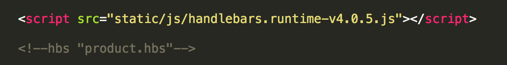
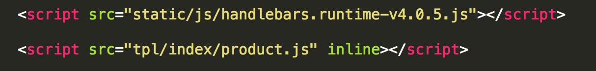

## 针对移动端的前端工作流(5)—Handlebars的预编译

在前后端分离的架构下，为了方便渲染，我们通常会选择模板引擎处理复杂的渲染逻辑。

我们曾纠结于mustache与handlebars，最终还是选择了功能更加强大的handlebars。

虽然handlebars功能强大，但是体积也大，在压缩后也有70K！！！

所以为了在功能强大与代码大小之间做个平衡，我们使用handlebars的预编译文件，为了方便开发，我们写了一个gulp插件
[`gulp-handlebars-precompile`](https://github.com/mqyqingfeng/gulp-handlebars-precompile)，可以提取html文件中的handlebars模板文件，预编译到指定目录,并且可以在html文件中建立script链接，在这里我们简单看下使用方法：

handlebars模板文件写在`src/tpl`目录下，建立一个文件如`product.hbs`

product.hbs文件：

``` html

{{#each data}}
<li href="{{itemLink}}">
    {{test}}
</li>
{{/each}}

```

html文件：

注意这里直接写文件名就可以了，会自动指向`src/tpl`目录。

```html
	<!--hbs "product.hbs"-->
```

在开启`gulp`命令的情况下会实时监控html文件的变化，保存时会自动提取模板文件，在`dev/tpl`建立以html文件名建立的文件夹，里面有预编译的js文件，即

源文件目录：

```
	├── gulpfile.js                # gulpfile文件
	├── src/                       # 源文件目录
	    └── index.html             # index.html
	    └── tpl/                   # 模板目录
	        └── product.hbs        # 模板文件
	└── dev/					   # 编译目录
```

dev目录：

```
	└── dev/                       # 编译目录
	    └── tpl/
	        └── index/
	            └── product.js
	    └── index.html             # index.html
```


看看编译后的`product.js`:

``` js

this["templates"] = this["templates"] || {};
this["templates"]["product"] = Handlebars.template({"1":function(container,depth0,helpers,partials,data) {
    var helper, alias1=depth0 != null ? depth0 : {}, alias2=helpers.helperMissing, alias3="function", alias4=container.escapeExpression;

  return "<li href=\""
    + alias4(((helper = (helper = helpers.itemLink || (depth0 != null ? depth0.itemLink : depth0)) != null ? helper : alias2),(typeof helper === alias3 ? helper.call(alias1,{"name":"itemLink","hash":{},"data":data}) : helper)))
    + "\">\n    "
    + alias4(((helper = (helper = helpers.test || (depth0 != null ? depth0.test : depth0)) != null ? helper : alias2),(typeof helper === alias3 ? helper.call(alias1,{"name":"test","hash":{},"data":data}) : helper)))
    + "\n</li>\n";
},"compiler":[7,">= 4.0.0"],"main":function(container,depth0,helpers,partials,data) {
    var stack1;

  return ((stack1 = helpers.each.call(depth0 != null ? depth0 : {},(depth0 != null ? depth0.data : depth0),{"name":"each","hash":{},"fn":container.program(1, data, 0),"inverse":container.noop,"data":data})) != null ? stack1 : "");
},"useData":true});

```

而且`src/index.html`中的

```html
	<!--hbs "product.hbs"-->
```
在`dev/index.html`中会被替换为

```html
	<script src="tpl/index/product.js" inline></script>
```
这里让我们看看它的具体配置文件

``` js

    .pipe(precompile({
        reg: /<!\-\-hbs\s+"([^"]+)"\-\->/g, // 设置提取文件的规则
        baseSrc: "src/tpl/",				// 设置文件根目录
        dest: "dev/tpl/",					// 设置编译到文件目录
        scriptSrc: 'tpl/',					// 设置替换后的script的前缀目录
        inline: true						// 是否要添加inline属性
    }))

```

当我们获得了预编译的文件后，我们该怎么使用呢？

举个例子：

`src/index.html`中引入`handlebars.runtime-v4.0.5.js`（压缩后13K）和要编译的模板文件，如图所示：



在`dev/index.html`就会编译成：



如果你想使用这个模板文件：

``` js

var html = templates.product(data);

$("body").append(html);

```

让我们来解释一下：

1. 假设 data 变量是你通过ajax请求获得的json数据
2. templates是命名空间，默认值，如果你想自定义命名空间，[点击查看](https://www.npmjs.com/package/gulp-handlebars-precompile#%E8%AE%BE%E7%BD%AE%E5%91%BD%E5%90%8D%E7%A9%BA%E9%97%B4)
3. product是方法名，使用的是你的模板文件的名称，传入的参数的 获得的数据，返回的是html片段


至于

``` html

 <script src="tpl/index/product.js" inline></script>

```

`script`标签会有`inline`属性呢？请接着往下看。