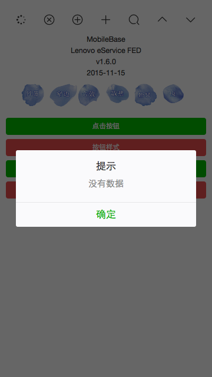
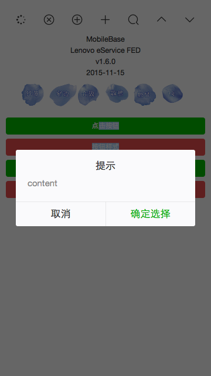
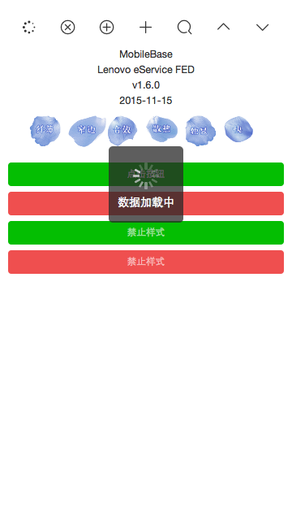
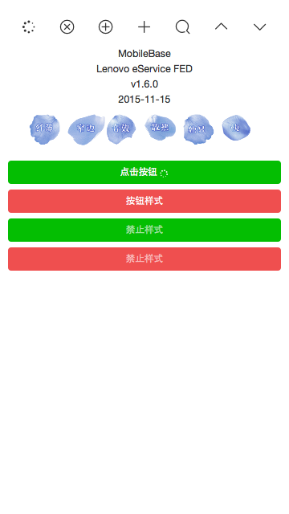

## 针对移动端的前端工作流(7)—WeUI样式的loading和dialog组件

### 有这个需求

因为移动端项目多用于微信端，所以我们用微信官方团队提供的[WeUI](https://weui.io/#/)样式简单封装了两个常用的插件,一个是`loading`组件，另一个是`dialog`组件

### [dialog组件](https://github.com/mqyqingfeng/dialog)

首先介绍的[`dialog`](https://github.com/mqyqingfeng/dialog)组件，包含`alert`和`confirm`两种样式，下面是它的使用方法：

在html文件中引入对应的css和js

``` html

<link rel="stylesheet" href="widget/dialog/dialog.css">

<script src="widget/dialog/dialog.js"></script>

```
js文件中调用

```js

lnv.alert({
    title: '提示',
    content: 'content',
    alertBtnText: '确定',
    alertHandler: function(){

		// 点击确定按钮的回调

    }
})

```

效果如下：



js文件中调用

```js

lnv.confirm({
    title: '提示',
    content: 'content',
    confirmBtnText: '确定选择',
    confirmHandler: function(){

		// 点击确定按钮的回调

    },
    cancelBtnText: '取消',
    cancelHandler: function(){

		// 点击取消按钮的回调

    }
})

```

效果如下：



### loading组件

接下来介绍`loading`组件，具有`pageloading`和`iconloading`两种样式。

在html文件中引入对应的css和js

``` html

<link rel="stylesheet" href="widget/loading/loading.css">

<script src="widget/loading/loading.js"></script>

```

js文件中调用：

```js

$.ajax({
        url: url,
        type: 'POST',
        data: sendData,
        beforeSend: function () {

        	//页面loading, 不能再进行其他操作，适合比如提交按钮
            lnv.pageloading();

        }
    })
    .done(function (res) {

    })
    .fail(function (jqXHR, textStatus, errorThrown) {

    })
    .always(function () {

		//在这里删除页面loading
        lnv.destroyloading();

    });

```

效果如下：



js文件中调用：

```js

$.ajax({
        url: url,
        type: 'POST',
        data: sendData,
        beforeSend: function () {

        	//按钮内调用，需要传入按钮的jquery对象
            lnv.iconloading("#submit_btn");

        }
    })
    .done(function (res) {

    })
    .fail(function (jqXHR, textStatus, errorThrown) {

    })
    .always(function () {

		//在这里删除按钮loading
        lnv.destroyloading("#submit_btn");

    });


```

效果如下：



### util.js

除了两个组件之外，我们也提供了一个帮助项目开发的util.js。

关于util.js，我们提供了两个常用的功能函数：

1.检测手机号码是否符合格式（匹配规则是第一位为1，其余有10位）

``` js

var phone = '189888888889';

console.log(lnv.checkPhone(phone)) // false

```

2.取出网址参数

``` js

// 假设当前的URL为 http://localhost:3000/index.html?phone=189888888889

console.log(lnv.getQueryString(phone)) // 189888888889

```