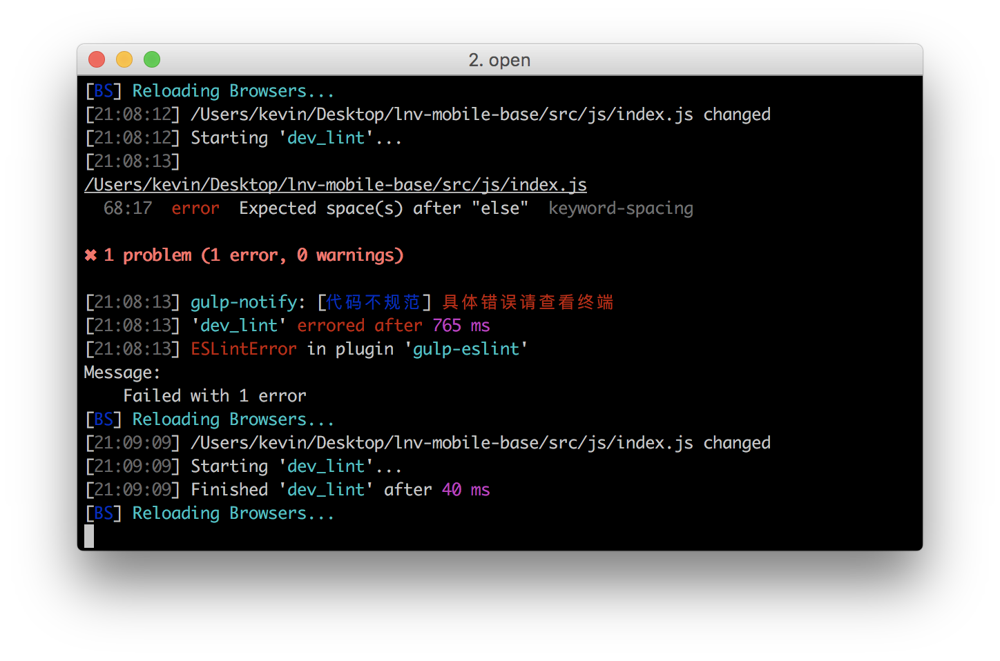

## 针对移动端的前端工作流(8)—ESLint

### 有这个需求

团队有规范，可是如何践行规范呢？

### ESLint

在开启`gulp`命令的情况下，每当js文件进行保存时，我们会对js文件进行代码检查，如果有不符合规范的地方，会有消息提醒，在mac下长这个样子：


具体的不规范内容请查看终端：



我们团队的JavaScript的编码规范是基于[百度的JavaScript编码规范](https://github.com/ecomfe/spec/blob/master/javascript-style-guide.md)，ESLint配置并没有覆盖所有的规范，具体的配置文件在`.eslintrc`中

``` json

{
  "env": {
    "browser": true,
    "node": true
  },
  "rules": {
    //使用了控制符分类不匹配任何字符串的正则表达式：var foo = /^abc[]/;
    "no-empty-character-class": "error",
    //函数参数不能够使用相同的参数名
    "no-dupe-args": "error",
    //在使用对象字面量申明对象的时候，不能够使用相同的键名
    "no-dupe-keys": "error",
    //在switch语句中，禁止使用相同的case值。
    "no-duplicate-case": "error",
    //为了消除代码中的空代码块，空代码块并不会导致技术性错误，但是在代码review时可能会代码疑惑。带空代码块中包含注释语句时，将不再视为错误。
    "no-empty": "error",
    //当错误发生并通过一个catch代码块去捕获错误时，有可能意外的重写了捕获的错误
    "no-ex-assign": "error",
    //尽管多余的分号不会导致代码错误，但是会使得代码难以理解
    "no-extra-semi": "error",
    //在通过函数声明书写函数时，函数被重写或者被重新赋值就会抛出错误。
    "no-func-assign": 2,
    //不要像函数一样调用Math和JSOM
    "no-obj-calls": "error",
    //在正则表达式中如果需要使用多个空格的时候，尽量使用量词，如{2}。而不是使用多个空格
    "no-regex-spaces": 2,
    //为了保证两行不相关的代码不会意外的被当做一行代码来解析了
    "no-unexpected-multiline": 2,
    //为了检测代码块、switch语句中不被使用到的代码
    "no-unreachable": 2,
    //不要和NaN做比较，而应该使用isNaN()
    "use-isnan": 2,
    //为了保证typeof 操作符返回的结果必须和 "undefined",  "object",  "boolean", "number", "string", 和  "function"作比较
    "valid-typeof": 2,
    "no-eval": "error",
    "no-delete-var": "error",
    //声明变量时不要覆盖JavaScript中的一些保留关键字
    "no-shadow-restricted-names": "error",
    //对象或者数组最后一个后面不加逗号
    "comma-dangle": [2, "never"],
    //定义数组字面量定义数组时，前后不加空格,var arr = ['foo', 'bar', 'baz'];
    "array-bracket-spacing": [2, "never"],
    //在单行代码块中，代码块前后需要留空白,if (foo) { bar = 0; }
    // "block-spacing": 2,
    //在这种写法中，if、else、try、catch都应该单独启一行
    "brace-style": [2, "stroustrup", { "allowSingleLine": true }],
    //代码块的开始和结尾是否应该留一个空行
    // padded-blocks: ["error", "always"],
    // 双峰驼命名格式
    "camelcase": 2,
    // 控制逗号前后的空格
    "comma-spacing": [2, { "before": false, "after": true }],
    //逗号应该放在行末
    "comma-style": [2, "last"],
    //在对象的动态属性（computed properties： ES6引入）中不添加空白
    "computed-property-spacing": [2, "never"],
    //冒号前面不留空白，后面有空格
    "key-spacing": [2, { "beforeColon": false, "afterColon": true }],
    //单行注释前空行，后不空行，块注释前后都有空行
    // "lines-around-comment": ["error", { "beforeBlockComment": true, "afterBlockComment": true, "beforeLineComment": true, "afterLineComment": false }]
    //函数名和括号之间不能有空格
    "no-spaced-func": "error",
    //字符串使用单引号
    "quotes": ["error", "single"],
    //规定分号前后不加空格，后加空格
    "semi-spacing": ["error", {"before": false, "after": true}],
    // if, else, for, while, do, switch, try, catch, finally, and with后加空格
    "keyword-spacing": ["error", { "after": true }],
    //代码块前是否需要加空格
    "space-before-blocks": "error",
    //function 关键字后面的小括号前加空格。
    "space-before-function-paren": 2,
    //规定圆括号内部的空格, foo('bar');
    "space-in-parens": ["error", "never"],
    //在操作符左右添加空格
    "space-infix-ops": "error",
    //在代码注释符号后面加一个空格
    "spaced-comment": ["error", "always"],
    //单行最大长度120
    "max-len": ["error", 120],
    //不得省略语句结束的分号
    "semi": 2
  }
}

```

如果你也想根据团队的规范修改配置，可以查看[eslint中文文档](https://github.com/Jocs/ESLint_docs)