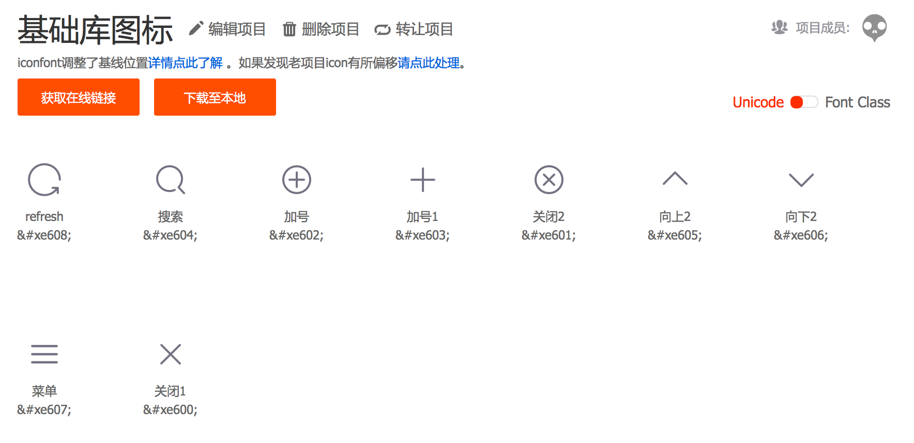
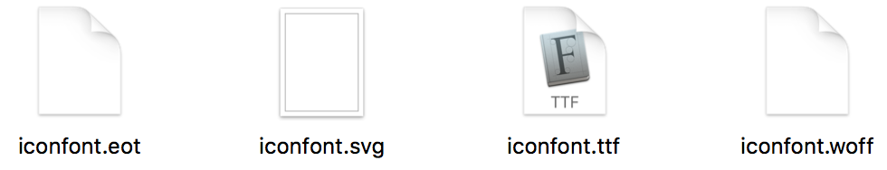

## 针对移动端的前端工作流(9)—字体图标的使用

### 字体图标很好用

图标类的图片一律采用字体图标的形式实现。

使用字体图标会有很多好处如：

1. 体积小： 一个图标字体比一系列的图像（特别是在Retina屏中使用双倍图像）要小。可以减少HTTP请求，还可以配合HTML5离线存储做性能优化。

2. 灵活性：图标字体可以用过font-size属性设置其任何大小，还可以加各种文字效果，包括颜色、Hover状态、透明度、阴影和翻转等效果。可以在任何背景下显示。而且不会像位图一样随着大小而变虚

3. 兼容性：网页字体支持所有现代浏览器

### 如何使用字体图标

1.到[http://www.iconfont.cn/](http://www.iconfont.cn/)，选择项目中用到的字体图，保存为一个项目，如下图：



2.然后点击“下载至本地”，会下载一个iconfont压缩包，里面有示例代码和字体文件，将字体文件替换掉示例的字体文件，需要替换的字体文件共有四个：



3.在html文件中使用

``` html

<i class="icon">&#xe600;</i>

```

4.i标签里面的标示量可以在上上一个图中或者压缩包中的示例代码中获得

5.此外在开发的过程中为了避免重复的劳动，可以使用“获取在线链接”功能